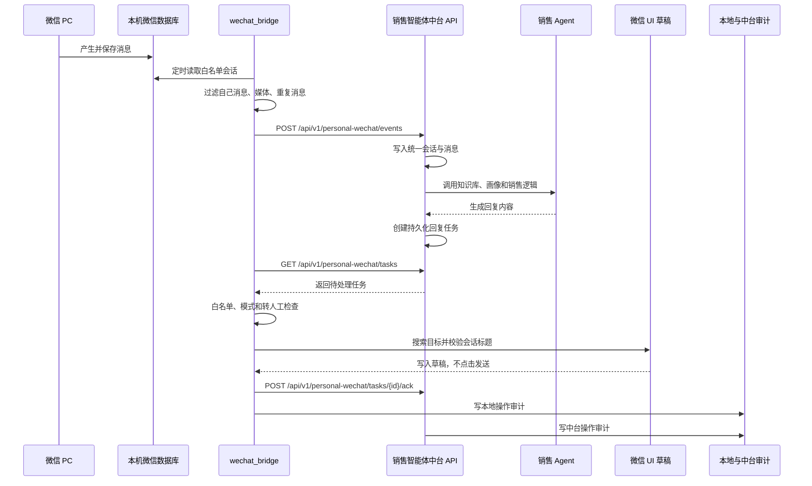
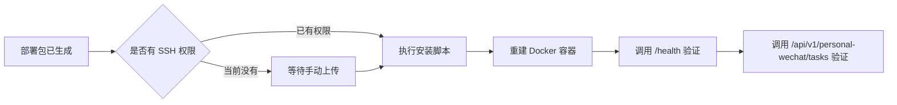

# 销售智能体当前链路与部署状态

> 检查日期：2026-09-10
> 范围：个人微信读取、销售智能体中台、定向回复任务、服务器部署状态

## 1. 状态总览

| 层级 | 当前状态 | 说明 |
|---|---|---|
| 本机代码 | 已完成 | 中台接口、本地桥接、草稿发送器均已实现 |
| 本机自动化测试 | 已通过 | 原有测试与个人微信桥接测试全部通过 |
| 本机运行状态 | 未启动 | 本地 API 5000 端口当前未监听 |
| 微信界面 | 未运行 | 未执行真实草稿验证 |
| 当前微信目标 | 测试客户 | 已加入白名单，模式为 `draft` |
| 安全开关 | 演练模式 | `dry_run=true`，`auto_send_enabled=false` |
| 生产服务器 | 在线 | `https://your-domain.example/health` 返回正常 |
| 生产个人微信接口 | 未部署 | 当前访问返回 404 |
| 部署包 | 已生成 | `release/personal-wechat-bridge-20260910.zip` |

## 2. 本机已实现链路



## 3. 本机各环节状态

### 3.1 微信读取

- 使用现有 `wechat-info-capture`。
- 本机账号已解密，可直接读取历史数据。
- 已修复微信 4.1 发送者编号错位问题。
- 已能正确区分“客户消息”和“自己发送的消息”。
- 最近 30 天“测试客户”会话识别结果：
  - 总消息 401 条。
  - 客户消息 263 条。
  - 自己发送 138 条。

### 3.2 白名单和去重

- 只处理 `wechat_bridge/config.json` 中的目标。
- 当前目标是联系人“测试客户”。
- 支持消息指纹去重。
- 支持回复任务去重。
- 图片、语音等媒体占位符默认跳过。

### 3.3 中台回复

- 消息写入现有统一会话表。
- 销售 Agent 使用知识库、客户画像和销售阶段生成回复。
- 回复任务持久化到数据库。
- 同一会话回复串行生成，避免上下文乱序。
- DeepSeek 余额异常时，自动切换百炼 `qwen-plus`。

### 3.4 UI 草稿

- 优先通过截图模板定位微信搜索。
- 搜索目标后检查顶部会话标题。
- 标题不一致时停止。
- 默认只写草稿，不发送。
- 全自动发送存在全局二次开关，当前关闭。

## 4. 当前本机未启用的部分

- 本地 API 服务没有持续运行。
- 微信 PC 客户端当前没有运行。
- 尚未进行真实草稿验证。
- 未开放自动发送。
- 未接入多账号、多设备和发送后回读确认。

## 5. 生产服务器状态



当前服务器情况：

- 主服务健康接口正常。
- PostgreSQL 连接正常。
- 新个人微信接口当前返回 404，说明新代码尚未部署。
- 部署包和安装脚本已准备好，但需要能登录服务器后执行。

## 6. 关键文件

- 桥接配置：`wechat_bridge/config.json`
- 本地运行入口：`wechat_bridge/run.py`
- 本机操作说明：`wechat_bridge/README.md`
- 中台接口：`api/personal_wechat.py`
- 中台核心服务：`core/personal_wechat.py`
- 部署包：`release/personal-wechat-bridge-20260910.zip`
- 服务器安装脚本：`deploy/install_personal_wechat_bridge_20260910.sh`

## 7. 启动顺序

### 仅本机演练

1. 启动销售智能体 API。
2. 运行 `python -m wechat_bridge.run --check`。
3. 运行 `python -m wechat_bridge.run --once`。

### 本机真实草稿

1. 登录并保持微信 PC 客户端运行。
2. 启动销售智能体 API。
3. 运行 `start_wechat_bridge_live_draft.bat`。
4. 检查微信输入框中的草稿，人工确认后再发送。

### 服务器部署

1. 上传 `release/personal-wechat-bridge-20260910.zip`。
2. 在服务器解压部署包。
3. 执行 `deploy/install_personal_wechat_bridge_20260910.sh`。
4. 执行 `deploy/verify_personal_wechat_20260910.sh`。

## 8. 结论

本机链路已经完成开发、自动化测试和演练检查，但没有处于持续运行状态。

服务器主业务在线，但个人微信桥接的新接口尚未部署。因此目前完整链路还不能跨本机和服务器直接运行。

## 9. 本地 MVP 实测记录

测试时间：2026-09-10

测试目标：微信昵称“测试客户”（备注名“测试客户备注”）

测试模式：`draft`

测试链路：

```text
模拟客户消息
→ 本地销售智能体 API
→ 生成持久化回复任务
→ 本地桥接领取任务
→ 激活并确认微信前台窗口
→ 搜索读取到的微信昵称“测试客户”
→ 点击精确搜索结果
→ 校验聊天窗口标题
→ 写入回复草稿
→ 回传 drafted 状态
```

测试结果：

- 中台接收事件成功。
- AI 回复任务生成成功。
- 本地桥接领取任务成功。
- 微信窗口焦点校验成功。
- 使用微信昵称“测试客户”搜索并打开会话成功。
- 顶部标题 OCR 校验成功。
- 回复已写入微信输入框。
- 任务最终状态为 `drafted`。
- 草稿没有自动发送。

测试截图：

`wechat_bridge/data/mvp_zhaoyouqing_draft_fixed.png`

测试过程中修复：

- 微信搜索结果改为 OCR 精确定位后点击，不依赖回车默认选择。
- 微信激活增加 Alt 焦点辅助和前台窗口强校验，避免把内容写入其他窗口。
- 顶部标题 OCR 区域调整为覆盖聊天区标题，同时避开左侧搜索框。

## 10. 自动接待实测记录

测试对象：微信昵称“测试客户”（备注名“测试客户备注”）

测试过程：

1. 建立历史消息基线，避免回复旧消息。
2. 该客户实际发送新消息 `666`。
3. 本地桥接检测到新消息并触发 Windows 提醒。
4. 消息同步到销售智能体中台。
5. 中台生成回复任务，主模型余额异常时自动切换到百炼 `qwen-plus`。
6. 本地发送器使用微信昵称“测试客户”搜索并打开会话。
7. 自动发送回复。
8. 重新解密并回读微信数据库，确认自动回复已经出现在会话中。

实测结果：

- 新消息读取：成功。
- 新消息提醒：成功。
- 中台同步：成功。
- RAG 回复生成：成功。
- 微信自动回发：成功。
- 发送后数据库回读：成功。
- 最终任务状态：`sent`。

实测消息顺序：

```text
客户：666
自动回复：您好！您是想了解我们的 AI 课程，还是对动画制作感兴趣呀？
```

运行配置：`wechat_bridge/config.live.json`

启动脚本：`start_wechat_auto_reply.bat`

一键启动本地 API 和自动回复桥接：

`start_local_auto_reply.bat`

该脚本会：

1. 启动本地销售智能体 API。
2. 等待 `/health` 正常。
3. 启动 `config.live.json` 对应的自动回复桥接。
4. 桥接退出时关闭本次启动的本地 API 进程。

## 11. 专用微信账号方案

正式启用时不建议继续使用当前混合联系人账号，而是使用一个全新的微信账号，只添加客户。

这种模式下：

- 微信账号本身就是客户范围，不需要逐人维护白名单。
- 自动处理所有私密联系人消息。
- 自动跳过群聊、公众号、文件传输助手和系统通知。
- 客户名称以微信当前会话显示名称为准。
- 客户的展示信息只使用微信昵称，备注名和 `wxid` 不作为客户名称。
- 消息内容、客户名称、微信标识和时间同步到中台。
- 回复仍通过 RAG、客户画像和销售 Agent 生成。
- 回复发送前校验客户名称，发送后回读数据库确认。

专用账号配置模板：

`wechat_bridge/config.dedicated-account.example.json`

正式启用时只需：

1. 登录全新的客户微信账号。
2. 完成一次微信读取工具的初始化和解密。
3. 复制并填写专用账号配置。
4. 启动本地中台和自动回复桥接。

## 12. 前端链路状态页

中台“渠道接入”下新增：

`客户接待链路`

页面展示：

- 本机桥接在线或离线。
- 当前微信账号和最近心跳。
- 自动回复或草稿模式。
- 新好友处理方式。
- 新消息提醒状态。
- 微信昵称与内容读取状态。
- 统一会话同步状态。
- RAG 与销售 Agent 状态。
- 微信定向回发状态。
- 发送后回读与审计状态。
- 待回复、已发送、草稿、失败和客户会话数量。
- 最近回复任务记录。

后端接口：

- `POST /api/v1/personal-wechat/bridge/heartbeat`
- `GET /api/v1/personal-wechat/status`

本地桥接每次轮询都会上报心跳，因此前端展示的是实际运行状态，不是静态示意图。
