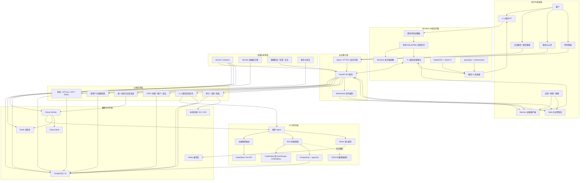
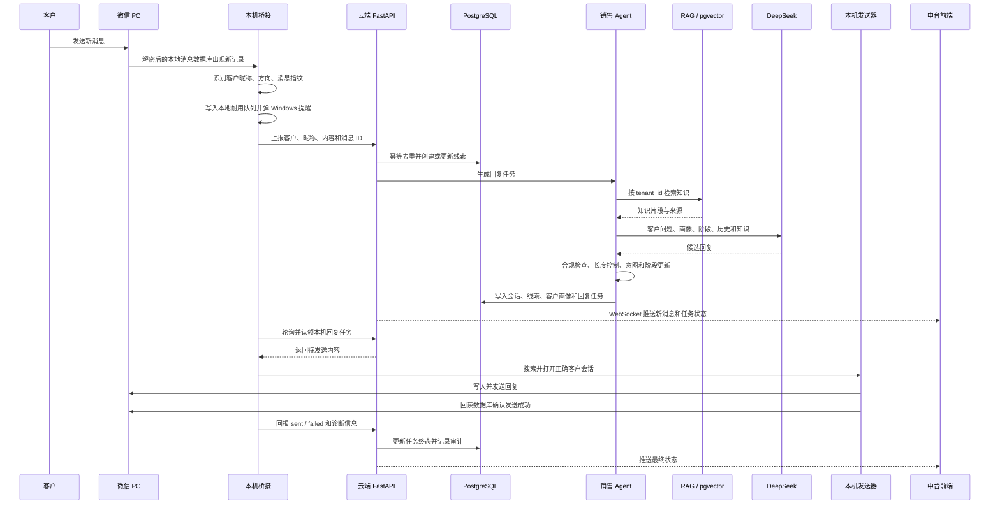

# 销售智能体技术栈与架构设计说明

日期：2026-09-18

## 一、先说明当前真实状态

当前系统已经不是早期单机版“LangChain + ChromaDB + SQLite”的形态，而是下面这套结构：

- 云端负责中台、业务数据、AI 回复、任务调度和实时通知。
- Windows 本机负责个人微信登录、消息读取、桌面提醒和微信 UI 发送。
- PostgreSQL + pgvector 是正式环境的知识向量主存储。
- JSON 向量文件只是本机开发、pgvector 不可用或小规模部署时的降级方案。
- Redis + Celery 负责跨进程任务、定时任务、去重、锁、限流状态和缓存。
- Electron 桌面客户端负责登录、中台页面、微信桥接开关和本地进程管理。

因此，旧的 ChromaDB 介绍只能作为历史资料，不能代表当前生产链路。

## 二、总体架构图

## 三、客户消息完整链路

## 四、技术栈与使用原因

| 阶段 | 当前技术 | 承担的职责 | 为什么用它 | 为什么暂时不用其他方案 |
|---|---|---|---|---|
| 后端 API | Python + FastAPI + Uvicorn | 中台接口、渠道回调、鉴权、WebSocket | AI 生态在 Python，FastAPI 异步性能好，Pydantic 校验强，开发和部署都轻 | Django 对纯 API 偏重；Flask 的异步、数据校验和接口治理能力较弱；Node 后端会割裂 AI/RAG 生态 |
| 数据建模 | SQLAlchemy ORM | 统一访问 PostgreSQL、SQLite 等数据库 | 一套模型兼容云上 PostgreSQL 和本地 SQLite，支持事务、连接池和租户隔离 | 直接拼 SQL 可维护性差，跨数据库困难，后期字段演进风险高 |
| 数据库迁移 | Alembic | 创建和升级表结构、校验结构一致性 | 可追踪每次结构变化，可在发布前阻断错误迁移 | `create_all` 只建缺失表，不会修改已有表，线上新增字段会静默失效 |
| 正式数据库 | PostgreSQL 16 | 客户、线索、会话、订单、权限、任务、审计和知识切片 | 事务、索引、JSON、连接池成熟，并能直接扩展 pgvector | SQLite 适合单机但不适合多 worker 和高并发；MySQL 当前不能像 pgvector 一样统一向量和业务数据 |
| 向量检索 | PostgreSQL + pgvector | 按租户保存和检索知识向量 | 业务数据和向量同库，支持过滤、版本和备份；多租户部署更简单 | Chroma/FAISS 原型方便，但会多一套存储、备份和权限体系；独立向量库更适合百万级以上规模 |
| 向量降级 | JSON 本地索引 | 本地开发或 pgvector 不可用时继续运行 | 零依赖、容易排障，小规模知识库足够 | 全量参与相似度计算，规模大后内存和 CPU 成本高，只适合作为降级路径 |
| 向量模型 | FastEmbed / BGE-small-zh | 生成中文知识向量 | ONNX 版本无需 GPU 和 PyTorch，体积和部署成本低 | 本地大模型嵌入部署重；通用云端嵌入成本和网络依赖更高，但保留 DashScope 作为可选方案 |
| RAG 编排 | LangChain Classic + LangChain Core | Prompt、Retriever、LLM 调用和结果组合 | 生态成熟，便于切换模型和检索器，减少自研胶水代码 | 完全自研短期可控，但 Prompt、检索器、模型适配都要重复维护；LangGraph 当前没有必要，系统不是复杂多 Agent 图执行 |
| 大模型 | DeepSeek OpenAI 兼容接口 | 理解客户意图并生成销售回复 | 中文销售场景效果好，成本较低，OpenAI 兼容接口迁移方便 | 本地大模型需要 GPU、模型运维和并发扩容；直接绑定单一云 SDK 容易形成厂商锁定 |
| 模型容灾 | 主备 LLM 路由 | 主模型失败或慢响应时切换备用模型 | 降低单一供应商故障对回复链路的影响 | 没有路由时，一个 Key 余额或服务异常会导致整个系统停止 |
| 状态与队列 | Redis | 分布式锁、去重、限流、会话、Celery broker 和状态 | 多进程共享、原子操作、过期时间成熟，适合实时状态 | 进程内存无法在多 worker 间一致；默认策略可能丢锁或去重键 |
| 语义缓存 | 独立 Redis 实例 | 缓存相似问题和已经生成的回答 | 必须使用 LRU 淘汰，不能和锁、去重键混用相同的淘汰策略 | 主 Redis 使用 `noeviction` 保状态，缓存 Redis 使用 `allkeys-lru`，职责必须隔离 |
| 异步任务 | Celery + Redis | 回复任务、定时跟进、质检、备份和知识重建 | 支持重试、超时、任务确认和独立 Worker，适合 Python 业务 | 线程池只适合单进程；RabbitMQ/Kafka 更强，但当前吞吐量下运维成本不值 |
| 定时任务 | Celery Beat | 每分钟或每天执行回收、跟进、检查和备份 | 调度与 API 进程解耦，多实例下只有一个调度器 | 进程内定时器在多副本会重复执行，重启后也会丢调度状态 |
| 实时通知 | WebSocket | 新消息、任务状态、告警推送到中台 | 比轮询延迟低、请求少，适合工作台实时刷新 | HTTP 轮询会造成无效请求和状态延迟；消息总线更重，需要额外基础设施 |
| 桌面客户端 | Electron | Windows 登录、中台页面、开关、桥接进程管理 | Web 技术复用中台页面，能管理本机后台进程和使用系统安全存储 | 纯浏览器无法稳定管理本机微信进程；PyQt 开发界面慢；Tauri 体积更小但需要重写部分集成 |
| 本机消息读取 | SQLite 只读 + 解密数据目录 | 读取微信 PC 新消息、联系人和会话 | 直接读本地真实数据，不依赖非官方在线协议，链路可审计 | Hook 或协议注入风险更高，兼容性差，也更容易触发账号风控 |
| 本机耐用队列 | SQLite WAL | 云端不可用时暂存消息和待发送任务 | 单文件、事务可靠、无需额外服务，重启后可恢复 | 纯内存队列重启即丢；直接依赖云端会导致网络波动时消息断链 |
| UI 自动化 | pyautogui + uiautomation | 搜索客户、点击会话、输入和发送 | 个人微信没有官方消息 API，UI 自动化是兼容现实环境的方案 | 协议机器人稳定性受版本和风控影响；企业微信官方接口才是规模化首选 |
| OCR 与视觉 | RapidOCR ONNX + OpenCV | 识别搜索框、联系人结果和界面状态 | 本地运行、无需 GPU、适合快速校验 UI 状态 | 大型视觉模型延迟高、成本高；纯坐标点击无法适应缩放和多版本 UI |
| 客户端鉴权 | API Key / JWT + Electron safeStorage | 登录、请求鉴权、本机凭据加密 | safeStorage 使用操作系统密钥保护，不在前端明文保存 | 明文写配置文件风险高；只依赖账号密码不适合机器桥接 |
| 租户隔离 | `tenant_id` + 请求上下文 + SQLAlchemy 自动过滤 | 不同企业共享一套服务但看不到彼此数据 | 成本低、升级简单，当前规模下维护效率最高 | 一租户一数据库隔离更强，但备份、迁移和资源成本高，适合强合规大客户阶段 |
| 权限体系 | RBAC + 数据范围 + 审计 | 控制菜单、接口和数据可见范围 | 角色与权限解耦，前后端都能按权限渲染和拒绝 | 只在前端隐藏按钮不安全，后端必须再做权限校验 |
| 部署 | Docker Compose | 编排 API、PostgreSQL、Redis、Celery、公众号入口 | 当前规模下单机部署稳定、可读、迁移方便 | Kubernetes 适合多节点和大规模弹性，但当前会增加运维复杂度 |
| 反向代理 | Nginx + HTTPS | TLS、域名、静态资源、隐藏内部端口 | 证书、压缩、限流和代理是成熟方案，API 端口不直接暴露公网 | Uvicorn 直接暴露公网缺少统一 TLS、限流和反向代理能力 |
| 发布治理 | 迁移服务 + 健康检查 + 失败阻断 | 保证数据库先升级，服务后启动 | 结构不一致时阻止发布，避免“代码已上、字段没上” | 手工执行迁移容易漏步骤，启动时自动建表无法安全修改已有结构 |
| 可观测性 | 日志、审计、健康检查、AI Ops | 定位回复失败、连接中断和性能问题 | 能从消息、任务、模型和发送四层排查 | 只看 API 是否 200 无法发现队列堆积、模型失败和消息未送达 |
| 合规与隐私 | 审计日志、保留策略、数据清理、脱敏 | 记录自动发送并限制数据长期滞留 | 商用系统必须能证明谁在何时对哪个客户做了什么 | 只存业务数据无法满足追责、删除和保留周期要求 |

## 五、关键设计思路

### 1. 先统一消息，再进入 AI

不同渠道不能各自直接调用模型，否则会出现重复回复、上下文不一致和无法审计。
所有消息先进入统一消息入口，完成归一化、去重、身份识别和任务创建，再进入销售 Agent。

### 2. 主链路可降级，但不静默成功

- Redis 不可用时，回复可以使用同步兜底。
- pgvector 不可用时，可以回退 JSON 向量索引。
- Celery 不可用时，可以同步执行部分任务。
- 微信发送失败必须明确记为失败，不能把“生成了回复”当成“客户已经收到”。

### 3. 每条消息都要有幂等键

渠道消息 ID、客户、内容和时间窗口共同生成去重键。
这样云端重试、桥接重启或网络超时后，不会给客户重复发送同一条消息。

### 4. 同一客户必须串行

同一客户的多条消息不能并行生成，否则后发消息可能先得到回复，上下文顺序会错乱。
Redis 分布式锁保证跨进程、跨 Worker 的同一客户串行处理。

### 5. 本地桥接只做“连接器”

本机桥接负责读取、提醒、发送和回报，不承担复杂业务决策。
客户档案、线索阶段、RAG、模型路由、权限和审计都放在云端中台。

### 6. 官方渠道优先，个人微信作为兼容模式

企业微信和微信客服有官方接口，更适合规模化、稳定性和合规要求。
个人微信没有官方消息 API，当前桥接依赖本机数据和 UI 自动化，适合小规模和专用接待号，不适合无上限并发。

## 六、当前技术选型的主要边界

- 个人微信桥接受微信客户端版本、Windows 环境、账号风控和 UI 变化影响，稳定性上限低于官方 API。
- JSON 向量索引不适合大规模知识库，正式部署应保持 pgvector 可用。
- 单机 Docker Compose 不是高可用集群，服务器故障时仍会有停机窗口。
- 共享数据库加 `tenant_id` 适合当前阶段，强监管客户可能需要独立数据库部署。
- LangChain 主要节省模型和检索适配成本，后续若链路复杂度继续上升，可以逐步替换成更薄的内部编排层。
- 真正的商用规模扩张，应优先把个人微信迁移到企业微信或微信客服，而不是无限强化 UI 自动化。
