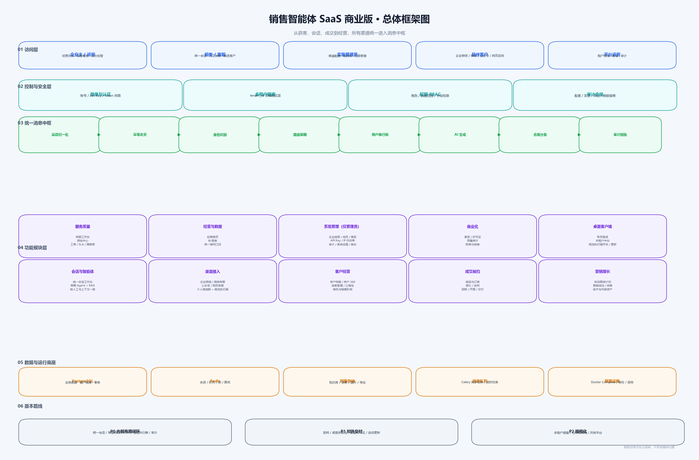
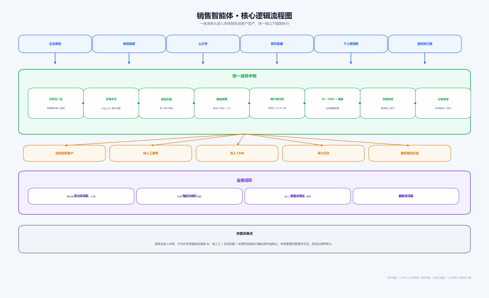

# 销售智能体框架图说明

本说明配合以下两张图使用：

---

## 一、总体框架图

### 1. 访问层

| 角色 | 主要功能 |
|---|---|
| 企业主 / 运营 | 查看经营总览、线索看板、待办与告警 |
| 销售 / 客服 | 在统一会话工作台接待客户、人工接管、跟进 |
| 实施管理员 | 配置渠道、知识库、权限和商品话术 |
| 最终客户 | 通过企业微信、个人微信、公众号、网页客服咨询 |
| 平台运营 | 管理租户、套餐、许可证、用量和审计 |

### 2. 控制与安全层

| 能力 | 功能说明 |
|---|---|
| 登录与认证 | 账号密码、API Key、Token 登录与吊销 |
| 多租户隔离 | 所有业务数据按 `tenant_id` 隔离 |
| 权限 RBAC | 角色、数据范围、字段权限 |
| 审计合规 | 配置、发送、导出、删除、转人工全部留痕 |

### 3. 统一消息中枢

这是整个系统最重要的设计。所有渠道收到的消息都要先进入这里，不允许某个渠道单独调用 AI 后自行发送。

| 步骤 | 功能 |
|---|---|
| 渠道归一化 | 把不同渠道事件转成统一消息结构 |
| 幂等去重 | 根据 `msg_id` 或内容指纹避免重复回复 |
| 身份识别 | 把渠道用户 ID 对应到统一客户身份 |
| 路由策略 | 判断自动回复、仅 @ 回复、人工接管、关闭 |
| 用户串行锁 | 同一用户消息按顺序处理，保持上下文一致 |
| AI 生成 | LLM + RAG + 客户画像 + 销售阶段生成回复 |
| 合规分条 | 敏感词检查、长回复分条、自然延迟 |
| 审计回执 | 发送成功或失败都记录结果 |

### 4. 功能模块层

| 模块 | 功能 |
|---|---|
| 会话与智能体 | 统一会话工作台、销售 Agent、RAG、转人工 |
| 渠道接入 | 企业微信、微信客服、公众号、网页客服、个人微信群、视觉执行器 |
| 客户经营 | 客户档案、客户 360、线索管理、公海池、商机 |
| 成交履约 | 商品与订单、报价合同、回款开票、交付记录 |
| 营销增长 | 自动跟进、营销活动、培育计划、话术内容 |
| 服务质量 | 客服工作台、质检中心、工单、SLA、满意度 |
| 经营与数据 | 经营首页、BI 报表、统一指标口径 |
| 系统管理（仅管理员） | 企业信息、成员、角色权限、API Key、IP 白名单、审计日志、系统设置、数据备份 |
| 商业化 | 套餐、许可证、用量统计、账单与续费 |
| 桌面客户端 | 账号登录、本租户中台、视觉执行器开关、自动更新 |

### 4.1 系统管理权限规则

系统管理是管理员专属模块，普通成员登录后侧边栏不显示该入口。即使用户手动输入系统管理地址，前端也不渲染页面，后端接口统一返回 403。

系统管理负责处理企业信息、成员账号、角色权限、API Key、IP 白名单、审计日志、系统设置和数据备份等需要管理员处理的事项。所有新增、编辑、删除、导出和恢复操作都必须写入审计日志。

### 5. 数据与运行底座

| 组件 | 功能 |
|---|---|
| PostgreSQL | 业务数据、租户隔离、事务 |
| Redis | 会话、队列、分布式锁、限流、幂等 |
| 对象存储 | 知识库文件、语音、图片、导出文件 |
| 消息队列 | Celery 异步任务、定时任务 |
| 部署运维 | Docker Compose、备份、监控、回滚 |

---

## 二、核心逻辑图

### 客户消息进入系统后的逻辑

1. 客户通过企业微信、微信客服、公众号、网页客服、个人微信群或视觉执行器发来消息。
2. 消息先进入统一消息中枢。
3. 中枢按顺序执行：归一化、去重、身份识别、路由判断、用户串行锁、AI 生成、合规检查、分条发送。
4. 处理完成后分流到四个结果：
   - 自动回复客户
   - 转人工接管
   - 写入客户、线索、商机、订单等 CRM
   - 写审计日志或触发后续跟进任务

### 业务闭环

- 客户与线索：统一客户身份、建档、评分、公海回收。
- 商机与成交：销售阶段、赢率、订单、回款。
- 服务与增长：转人工、质检、跟进、复购。
- 数据与经营：看板、BI、报表，用来判断产品是否有效。

### 关键决策点

- 消息必须先进入统一消息中枢，不能各渠道单独调用 AI。
- 非目标群、私聊关闭、未授权视觉执行器等场景必须提前停止。
- 客户触发“转人工”后，AI 停止自动回复并通知负责人。
- 所有自动发送必须有审计记录。

---

## 三、版本路线

| 阶段 | 目标 |
|---|---|
| P0 内部商用闭环 | 统一会话、渠道收敛、CRM、视觉执行器、审计 |
| P1 对外交付 | 官网、桌面安装包、套餐许可证、自动更新 |
| P2 规模化 | 多租户增强、白标私有化、开放平台 |
