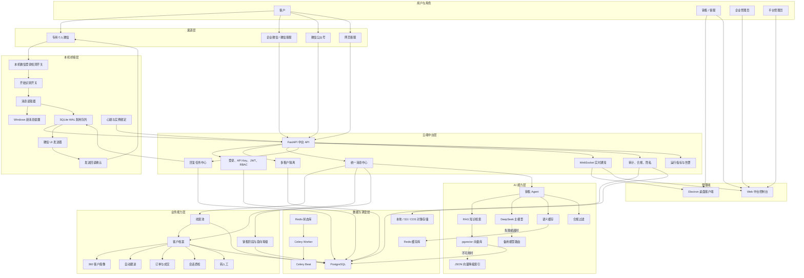
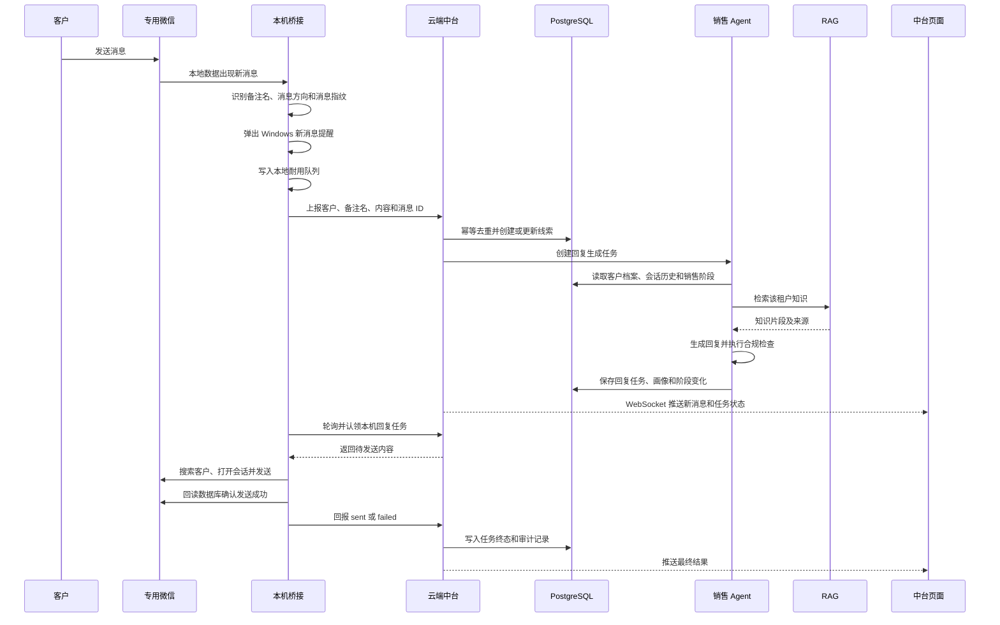
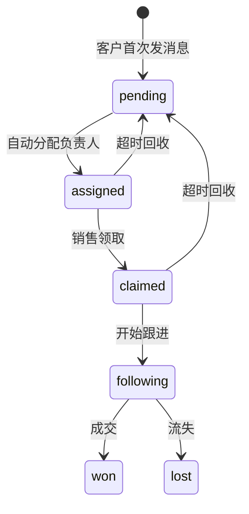
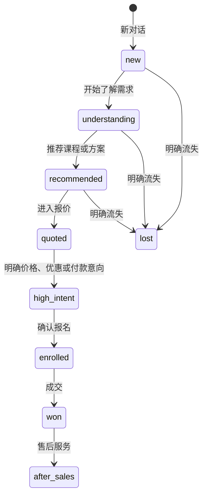
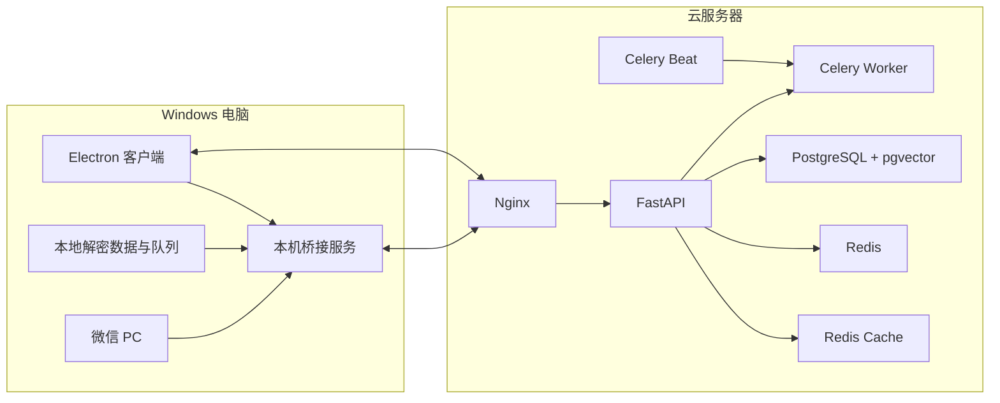

# 销售智能体总体框架文档

日期：2026-09-18

## 一、文档定位

本文档描述当前销售智能体的总体产品框架、业务链路、系统边界、运行状态和技术落地方式，重点覆盖“个人微信客户接待链路”。

技术选型原因和替代方案对比见：

- `docs/技术栈与架构设计说明-20260918.md`
- `docs/个人微信读取-中台-定向回复链路.md`

## 二、产品定位

当前系统是一套面向专用微信账号的销售客服智能体：

1. 客户给专用微信发送消息。
2. 本机检测到新消息并弹出提醒。
3. 本机读取客户微信备注名和消息内容。
4. 客户和消息同步到云端中台。
5. 首次聊天先进入线索池。
6. 销售意向达到 L3 后，线索升级为正式客户。
7. 销售 Agent 结合客户画像、历史会话和 RAG 知识生成回复。
8. 回复任务回到本机，通过微信 UI 自动发送。
9. 系统回读微信数据库确认已经发送。
10. 所有关键动作记录状态、诊断和审计结果。

当前版本不包含自动同意好友。正式启用时使用一个全新的专用微信账号，只添加客户。

## 三、总体框架图

## 四、个人微信客户接待链路

## 五、核心模块

| 模块 | 主要职责 | 关键结果 |
|---|---|---|
| 本机登录检测 | 检测微信进程、窗口和账号数据是否可用 | 决定本机桥接是否已经具备运行条件 |
| 开始识别开关 | 控制是否读取新消息、上报中台和领取回复任务 | 关闭时不识别，打开时进入运行状态 |
| 消息读取器 | 读取微信本地数据库、联系人和会话 | 得到客户备注名、消息内容、方向和时间 |
| 新消息提醒 | 在 Windows 本机弹出通知 | 客服可以及时知道客户发来消息 |
| 本机耐用队列 | 云端异常时暂存消息和任务 | 网络恢复后继续补传，不因短暂中断丢失 |
| 客户名称统一 | 有备注时统一使用客户备注名 | 会话、线索、客户和任务名称保持一致 |
| 统一消息中心 | 去重、归一化、租户识别和任务创建 | 防止重复回复和跨租户串数据 |
| 线索管理 | 首次对话先进入线索池 | 新客户先沉淀，不立即全部转正式客户 |
| 客户档案 | L3 后建立正式客户并持续更新 | 保存画像、阶段、意向、历史和跟进信息 |
| 销售 Agent | 结合知识、画像、阶段和历史生成回复 | 输出符合销售流程的候选回复 |
| RAG 知识库 | 检索产品、课程、价格和政策知识 | 回复有知识依据并保留来源 |
| 回复任务中心 | 管理生成、认领、发送、确认和失败重试 | 确保每个客户消息最终有明确状态 |
| 转人工 | 识别人工、投诉、退款等关键词 | 停止自动回复并通知负责人 |
| 实时通知 | 向中台推送消息、任务和告警状态 | 页面无需频繁刷新 |
| 审计与合规 | 记录读取、生成、发送、失败和人工操作 | 出现问题时可以完整追责和回放 |

## 六、运行状态与开关

### 1. 本机微信登录检测开关

打开时检查：

- `Weixin.exe` 或微信进程是否运行。
- 微信主窗口是否存在。
- 当前账号的数据目录是否可读取。
- 必要数据是否已经完成解密。

关闭时不执行登录检测，本机运行状态只由“开始识别”开关控制。

### 2. 开始识别开关

关闭时：

- 不读取新消息。
- 不上报中台。
- 不领取回复任务。
- 不操作微信发送。

打开时：

- 读取新客户消息。
- 执行提醒、去重、上报和回复任务认领。
- 按专用账号配置进入自动回复模式。

### 3. 回复模式

| 模式 | 行为 |
|---|---|
| `off` | 不处理该客户 |
| `draft` | 只生成草稿，不实际操作微信 |
| `manual` | 只提醒，等待人工处理 |
| `auto` | 自动生成、发送并回读确认 |

当前专用微信账号正式测试时使用自动回复模式，但启动时仍应先建立历史消息基线，避免回复老消息。

## 七、线索与客户状态

### 1. 线索状态

### 2. 销售阶段

### 3. 意向等级

| 等级 | 定义 | 是否建档 |
|---|---|---|
| L1 陌生/观望 | 刚接触，没有明确需求 | 只在线索池 |
| L2 兴趣了解 | 开始询问方向、基础或课程 | 只在线索池 |
| L3 意向明确 | 有明确需求、产品方向或购买关注 | 升级为正式客户 |
| L4 高意向 | 重点询问价格、优惠、报名方式 | 正式客户 |
| L5 已报名/已成交 | 已完成报名、付款或成交 | 正式客户 |

## 八、客户名称统一规则

客户名称以本机微信中设置的备注名为准。

同步范围包括：

- 本机会话名称。
- 云端 ChannelSession。
- 线索昵称。
- 正式客户昵称。
- 回复任务中的客户名称。
- 中台页面显示名称。

如果微信备注名发生变化，下一次同步会把中台相关名称统一更新为最新备注名。

没有备注名时，才回退使用微信昵称，不能把 `wxid` 作为客户显示名。

## 九、关键技术落地

| 层次 | 技术实现 |
|---|---|
| 本地消息读取 | Python、SQLite 只读、微信本地数据解密 |
| 本地消息可靠性 | SQLite WAL 队列、消息指纹、任务状态 |
| 微信发送 | pyautogui、uiautomation、pyperclip |
| 界面识别 | RapidOCR ONNX、OpenCV |
| 云端 API | FastAPI、Pydantic、Uvicorn |
| 数据访问 | SQLAlchemy |
| 正式数据库 | PostgreSQL 16 |
| 结构升级 | Alembic |
| 状态与并发 | Redis 分布式锁、去重键、限流 |
| 异步任务 | Celery Worker、Celery Beat |
| AI 编排 | LangChain Classic、销售 Agent |
| 大模型 | DeepSeek OpenAI 兼容接口、主备模型路由 |
| 向量与 RAG | pgvector、FastEmbed 或 DashScope Embedding |
| 降级检索 | 租户隔离 JSON 向量索引 |
| 缓存 | Redis 语义缓存 |
| 实时通知 | WebSocket |
| 桌面客户端 | Electron、safeStorage |
| 部署 | Docker Compose、Nginx、健康检查 |
| 安全和合规 | API Key、JWT、RBAC、租户隔离、审计、保留策略 |

## 十、部署拓扑

## 十一、稳定性设计

### 1. 幂等

每条微信消息生成本地指纹和云端消息键。重复读取、网络重试或桥接重启时，不会重复创建任务和重复回复。

### 2. 同一客户串行

同一个客户上一条消息没有处理完时，下一条消息等待，避免回复顺序错乱。

### 3. 任务状态可见

回复任务至少包含：

- pending
- generating
- ready
- claimed
- sending
- sent
- failed
- manual_review

每个失败状态必须附带失败阶段、错误码和诊断信息。

### 4. 发送回读

本机不能把“已经执行了点击”当成发送成功，必须重新读取微信数据确认目标会话中存在对应发出消息。

### 5. 实例绑定

每台电脑生成唯一 `instance_id`。回复任务只允许绑定该实例的本机桥接领取，避免 A 电脑的任务被 B 电脑错误发送。

### 6. 降级

- Redis 不可用时，部分任务可以同步执行。
- pgvector 不可用时，可以使用 JSON 索引。
- Celery 不可用时，部分任务可以同步执行。
- 任何降级都必须写日志，不能静默假装成功。

## 十二、安全与合规

- 所有云端请求必须携带 API Key 或登录 Token。
- 所有业务数据按 `tenant_id` 隔离。
- 角色权限同时在前端和后端校验。
- 客户名称、聊天内容和发送结果进入审计链路。
- 敏感配置使用环境变量或加密密钥，不进入源码。
- 聊天记录和审计日志按保留策略清理。
- 自动回复、人工接管、投诉、退款和停止触达都要留下记录。

## 十三、当前边界

当前版本不属于以下范围：

- 不自动同意微信好友。
- 不通过协议 Hook 接管个人微信。
- 不承诺个人微信无上限并发。
- 不把视觉执行器作为客户接待主链路。
- 不允许渠道绕过统一消息中心直接调用模型。
- 不把“生成回复”视为“发送成功”。

## 十四、后续演进

| 阶段 | 重点 |
|---|---|
| 当前阶段 | 专用微信稳定接待、消息同步、线索沉淀、RAG 回复和发送回读 |
| 稳定性阶段 | 提高微信读取、任务认领、自动发送和异常恢复成功率 |
| 商用阶段 | 多租户、权限、审计、监控、备份和升级流程完善 |
| 规模化阶段 | 企业微信和微信客服优先，个人微信只保留兼容模式 |
| 平台化阶段 | 开放渠道、独立数据库选项、插件化和行业知识模板 |

## 十五、一页总结

当前系统的核心不是“让大模型直接回微信”，而是：

**本机桥接负责连接微信，云端中台负责业务和 AI，数据库负责统一状态，审计负责证明结果。**

只要保持这个边界，后续替换模型、向量库、微信渠道或桌面客户端，都不会推翻整个销售接待链路。

