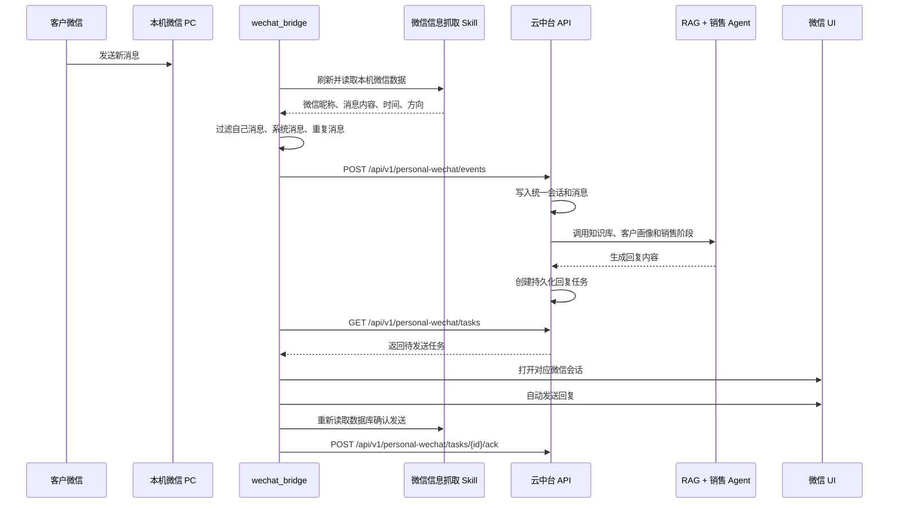

# 销售智能体项目交接文档

> 文档日期：2026-09-11
> 当前阶段：本地客户接待链路已跑通，正在从独立脚本运行方式迁移到桌面客户端统一管理
> 适用对象：继续开发、部署、测试或维护本项目的后续人员

---

## 1. 项目定位

本项目是面向销售和客服场景的 AI 客户接待系统，当前重点能力是：

1. 在本机 Windows 微信客户端上检测客户消息。
2. 读取客户微信昵称和消息内容。
3. 将客户和消息同步到云中台。
4. 使用知识库、客户画像和销售 Agent 生成回复。
5. 通过本机微信客户端将回复发送给对应客户。
6. 重新读取微信数据库，确认消息已经发送。
7. 在网页端或桌面客户端展示链路状态和任务记录。

当前设计主要面向一个专用客户微信账号。正式使用时，建议使用全新的微信账号，只添加客户，不混入个人好友、群聊或无关公众号。

---

## 2. 交接对象与环境

### 2.1 项目目录

当前完整项目位于：

```text
C:\Users\1\Documents\销售客服智能体
```

另有一个用于临时预览的静态页面目录：

```text
C:\Users\1\Documents\销售智能体coding
```

后者不是正式项目源码，只包含静态页面预览。

### 2.2 云端服务

```text
域名：https://your-domain.example
服务器公网 IP：<your-server-ip>
服务端项目目录：/opt/sales-agent
API 容器映射：127.0.0.1:5010 -> 容器 5000
健康检查：https://your-domain.example/health
中台页面：https://your-domain.example/static/console.html
```

### 2.3 本机环境

```text
操作系统：Windows
微信版本：4.1.x
微信读取工具：%USERPROFILE%\.workbuddy\skills\微信信息抓取\scripts\capture.py
Python：项目当前使用本机 Python
桌面端：Electron
```

---

## 3. 当前整体链路



---

## 4. 各模块说明

### 4.1 微信消息读取

核心文件：

```text
wechat_bridge/reader_adapter.py
%USERPROFILE%\.workbuddy\skills\微信信息抓取\scripts\capture.py
```

职责：

- 查找本机微信账号和解密数据目录。
- 定时执行微信数据库解密刷新。
- 读取联系人和消息。
- 读取微信原始昵称 `nick_name`，不使用备注名。
- 判断消息是自己发送还是客户发送。
- 合并微信多个消息分片，避免新消息写入后续分片后漏读。

当前登录检测方式：

```text
微信进程存在
+ 微信窗口标题等于“微信”
+ 当前微信账号数据目录可用
= 判定微信已登录
```

### 4.2 本地桥接服务

核心目录：

```text
wechat_bridge/
```

主要文件：

| 文件 | 作用 |
|---|---|
| `run.py` | 主循环、状态控制、消息上报、任务处理 |
| `reader_adapter.py` | 封装微信读取 Skill |
| `message_filter.py` | 消息过滤、幂等指纹、自己消息识别 |
| `ui_sender.py` | 搜索客户、校验目标、写入并发送微信消息 |
| `central_client.py` | 调用云中台 API |
| `notifier.py` | Windows 新消息提醒 |
| `audit.py` | 本地去重状态与审计日志 |
| `config.py` | 配置加载与相对路径解析 |

桥接运行逻辑：

```text
读取中台设置
→ 判断“开始识别”是否打开
→ 判断是否需要检测微信登录
→ 读取新消息
→ 上报中台
→ 领取中台回复任务
→ 微信定向发送
→ 回读数据库验证
→ 上报发送结果
→ 写心跳和审计
```

### 4.3 中台个人微信接口

核心文件：

```text
api/personal_wechat.py
core/personal_wechat.py
```

接口：

| 方法 | 路径 | 用途 |
|---|---|---|
| POST | `/api/v1/personal-wechat/events` | 接收本机微信事件 |
| GET | `/api/v1/personal-wechat/tasks` | 本地桥接领取回复任务 |
| POST | `/api/v1/personal-wechat/tasks/{task_id}/ack` | 回传发送结果 |
| POST | `/api/v1/personal-wechat/bridge/heartbeat` | 本机桥接心跳 |
| GET | `/api/v1/personal-wechat/status` | 查询链路状态 |
| GET | `/api/v1/personal-wechat/settings` | 查询开关配置 |
| POST | `/api/v1/personal-wechat/settings` | 修改开关配置 |

### 4.4 销售 Agent 与 RAG

核心文件：

```text
core/agent.py
core/rag.py
core/llm_router.py
config/sales_prompt.txt
```

处理内容：

- 检索知识库。
- 读取客户画像和销售阶段。
- 结合历史会话生成回复。
- 识别转人工关键词。
- 记录会话摘要、客户档案和调用日志。

当前主模型为 DeepSeek。DeepSeek 余额不足或连续失败时，会自动切换为百炼 `qwen-plus`。

### 4.5 微信 UI 发送

核心文件：

```text
wechat_bridge/ui_sender.py
```

发送前会：

1. 强制激活微信窗口。
2. 校验前台窗口确实是微信。
3. 搜索客户微信昵称。
4. 从搜索结果中精确选择联系人。
5. 校验聊天窗口标题。
6. 清空输入框后粘贴回复。
7. 自动发送。
8. 回读数据库验证发送内容。

当前自动发送默认需要同时满足：

```text
开始识别 = 打开
目标客户模式 = auto
全局自动发送 = 打开
发送后回读成功
```

---

## 5. 控制开关

### 5.1 开始识别

前端位置：

```text
渠道接入 → 客户接待链路 → 开始识别
```

规则：

- 关闭：桥接可以保持在线心跳，但不读取消息、不生成回复。
- 打开：启用完整消息识别和回复链路。

### 5.2 检测本机微信登录

规则：

- 打开：未检测到微信登录时暂停；检测到登录后自动开始运行。
- 关闭：跳过微信登录检测。

两个开关都保存在中台，本机桥接每次轮询时同步。

### 5.3 桌面客户端集成

桌面端文件：

```text
desktop-client/main.js
desktop-client/preload.js
desktop-client/renderer/index.html
```

桌面客户端通过 IPC 管理本机桥接进程：

- “开始识别”打开时启动桥接子进程。
- “开始识别”关闭时停止桥接子进程。
- 桌面客户端退出时停止桥接子进程。

网页端由于浏览器安全限制，不能直接启动本机 Windows 程序。

---

## 6. 前端说明

### 6.1 正式网页端

```text
static/console.html
```

访问：

```text
https://your-domain.example/static/console.html
```

### 6.2 桌面端

```text
desktop-client/renderer/index.html
```

桌面端安装包：

```text
desktop-client/dist/SalesAgentConsole Setup 1.0.0.exe
```

### 6.3 当前前端页面

“客户接待链路”页面展示：

- 本机桥接连接状态。
- 开始识别状态。
- 微信登录检测状态。
- 微信昵称识别。
- 新消息提醒。
- 中台同步。
- RAG 与销售 Agent。
- 微信定向回发。
- 发送后回读。
- 待回复、已发送、草稿、失败和会话数量。
- 最近回复任务。

注意：网页端和桌面端页面目前是两份 HTML，修改时需要同步更新。后续建议改成单一前端工程。

---

## 7. 数据模型

关键表：

| 表 | 说明 |
|---|---|
| `channel_sessions` | 统一客户会话 |
| `channel_messages` | 统一消息记录 |
| `personal_wechat_reply_tasks` | 本机微信回复任务 |
| `personal_wechat_bridge_instances` | 本机桥接实例、心跳和开关 |
| `message_dedup` | 全局消息幂等 |
| `customers` | 客户档案 |
| `leads` | 线索 |
| `audit_logs` | 中台审计 |

桥接实例常用字段：

```text
instance_id
account_id
status
recognition_enabled
detect_wechat_login
wechat_login_detected
last_seen
last_message_at
last_reply_at
last_error
detail_json
```

---

## 8. 配置文件

### 8.1 本机轮询测试

```text
wechat_bridge/config.auto-test.json
```

### 8.2 本机连接云端

```text
wechat_bridge/config.cloud-test.json
```

### 8.3 桌面客户端内置配置

```text
wechat_bridge/config.desktop.json
```

### 8.4 专用客户账号模板

```text
wechat_bridge/config.dedicated-account.example.json
```

正式使用专用账号时建议：

```json
{
  "auto_discover_contacts": true,
  "default_contact_mode": "auto",
  "targets": []
}
```

---

## 9. 本地运行方式

### 9.1 单独运行桥接

```powershell
cd "C:\Users\1\Documents\销售客服智能体"
python -m wechat_bridge.run --config wechat_bridge\config.cloud-test.json
```

### 9.2 只做连接检查

```powershell
python -m wechat_bridge.run --config wechat_bridge\config.cloud-test.json --check
```

### 9.3 桌面客户端

安装并打开：

```text
SalesAgentConsole Setup 1.0.0.exe
```

然后在：

```text
渠道接入 → 客户接待链路
```

打开“开始识别”。

---

## 10. 云端部署

### 10.1 云端部署包

最新包（如服务器未部署请使用）：

```text
release/personal-wechat-cloud-20260911-v4.zip
```

该包已经通过中台上传接口放到服务器：

```text
/opt/sales-agent/data/knowledge_base/personal-wechat-cloud-20260911-v4.zip
```

### 10.2 部署命令

```bash
cd /opt/sales-agent

DEST=/opt/sales-agent/releases/personal-wechat-flow-20260911-v4
mkdir -p "$DEST"

unzip -o \
  data/knowledge_base/personal-wechat-cloud-20260911-v4.zip \
  -d "$DEST"

bash "$DEST/deploy/install_personal_wechat_flow_20260911.sh" "$DEST"
```

### 10.3 验证

```bash
BASE_URL=https://your-domain.example \
API_KEY=你的APIKey \
bash /opt/sales-agent/releases/personal-wechat-flow-20260911-v4/deploy/verify_personal_wechat_flow_20260911.sh
```

---

## 11. 测试

完整回归：

```powershell
cd "C:\Users\1\Documents\销售客服智能体"
.\run_tests.bat
```

个人微信专项测试：

```powershell
python tests\test_personal_wechat.py
```

桌面端 smoke：

```powershell
cd desktop-client
npm run smoke
```

桌面端构建：

```powershell
cd desktop-client
npm run build
```

当前测试结果：

- 核心测试套件通过。
- 个人微信桥接专项测试通过 20 项。
- 真实微信测试中，“测试客户”发送 `666` 后，系统完成 AI 回复、自动发送和数据库回读。
- Electron 打包客户端 smoke 测试通过。

---

## 12. 当前已完成

- 微信新消息读取。
- 微信原始昵称识别，不使用备注名。
- 自己发送消息过滤。
- 本地消息去重。
- Windows 新消息提醒。
- 云端事件同步。
- 统一会话和消息入库。
- RAG、客户画像和销售 Agent。
- DeepSeek 失败后切换百炼。
- 微信定向发送。
- 发送后数据库回读。
- 本机桥接心跳。
- 开始识别总开关。
- 微信登录检测开关。
- 网页端客户接待链路页面。
- 桌面端客户接待链路页面。
- 桌面端一键启动和停止桥接。
- 服务器部署和验证脚本。

---

## 13. 尚未完成或需要注意

### 13.1 没有 Git 版本库

当前项目目录不是 Git 仓库，缺少分支、提交历史和回滚能力。

接手后建议第一步：

```bash
git init
git add .
git commit -m "initial handover snapshot"
```

提交前确认 `.env`、`server.env`、数据库、日志和运行数据没有被加入。

### 13.2 两份前端需要手工同步

```text
static/console.html
desktop-client/renderer/index.html
```

修改其中一个页面时，必须同步另一个。

### 13.3 桌面端依赖本机 Python

当前 Electron 通过 `pythonw.exe` 启动桥接，目标电脑需要：

- Python 3.11
- `wechat_bridge/requirements.txt`
- 微信读取 Skill
- 已初始化微信解密数据

长期方案是将 Python 运行时和桥接程序一起打包，避免依赖用户手工安装 Python。

### 13.4 非官方微信通道风险

个人微信没有稳定的官方发送 API。当前方案依赖本机数据库读取和 UI 自动化，存在：

- 微信升级后 UI 变化。
- 平台风控。
- 电脑息屏、锁屏、休眠导致中断。
- 微信退出登录导致暂停。

建议作为专用设备运行，电脑保持登录，不用于人工日常聊天。

### 13.5 当前测试数据需要清理

测试过程中在本地和中台留下了部分任务记录。正式上线前建议：

- 使用新账号。
- 使用新租户或清理测试会话。
- 清空 `wechat_bridge/data/*test*`。
- 保留审计日志备份后再清理。

### 13.6 主模型余额

DeepSeek 当前存在余额不足情况。系统会自动切换百炼 `qwen-plus`，但正式上线前应确认：

- DeepSeek 余额或更换主模型。
- 百炼备用 Key 可用。
- 两套模型的费用和限流。

---

## 14. 接手后的建议顺序

1. 复制完整项目到新的开发电脑。
2. 安装 Python 和 `requirements.txt`。
3. 配置 `.env`，密钥单独安全交接。
4. 初始化 Git。
5. 在本机运行 `python tests\test_personal_wechat.py`。
6. 运行桥接 `--check`。
7. 确认云端 `/health` 和个人微信状态接口。
8. 安装桌面客户端并测试“开始识别”开关。
9. 使用专用微信账号和专用测试客户完成一条真实消息测试。
10. 再接入正式客户。

---

## 15. 交接时必须单独传递的内容

以下内容没有放进源码交接包：

- `.env`
- `server.env`
- DeepSeek API Key
- 百炼 API Key
- 中台 API Key
- 企业微信和公众号密钥
- 本机微信解密数据
- 客户数据库
- 向量库
- 运行日志和审计数据

这些内容需要通过加密文件、密码管理工具或安全的内部渠道单独交接。

---

## 16. 快速排障

### 前端一直没有连接

检查：

```powershell
python -m wechat_bridge.run --config wechat_bridge\config.cloud-test.json --check
```

如果检查结果是 `logged_in: true` 且心跳成功，说明本机正常，问题在桥接进程没有持续运行。

### 微信已登录但检测失败

检查：

- 微信进程是否运行。
- 窗口标题是否严格为“微信”。
- 微信读取账号是否已经完成 `key` 和 `decrypt`。
- `account_id` 是否指向当前登录账号。

### 页面显示“已连接 / 待识别”

表示桥接在线，但“开始识别”关闭。

### 页面显示“等待微信登录”

表示开始识别已开启，但微信登录检测不通过。

### 页面显示“离线”

表示 90 秒内没有收到桥接心跳。启动桌面客户端并打开“开始识别”，或临时运行：

```text
start_cloud_auto_reply.bat
```

---

## 17. 推荐后续演进

1. 将前端收敛为一个构建工程。
2. 将桌面端和桥接打包为单一安装包。
3. 增加发送失败自动诊断和人工接管。
4. 使用专用账号和专用设备。
5. 增加多实例心跳、实例选择和故障切换。
6. 对消息、回复、发送回执建立更完整的可观测性。
7. 清理测试数据，建立正式租户和客户数据隔离。
8. 增加自动更新和版本兼容检查。
